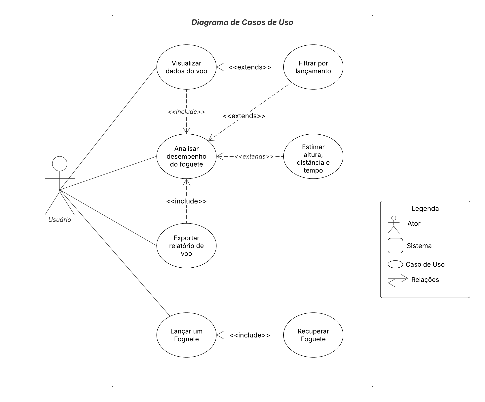

# Diagrama de Casos de Uso

## Introdução

Casos de uso são essenciais na modelagem de sistemas, servindo como uma ferramenta importante para representar graficamente os requisitos funcionais. Eles descrevem como o sistema interage com os usuários para alcançar objetivos específicos. Em termos simples, os casos de uso detalham as ações que um sistema ou um conjunto de sistemas deve executar em colaboração com um ou mais usuários externos. Essa abordagem facilita a compreensão das funcionalidades desejadas, aprimorando a comunicação entre desenvolvedores e stakeholders, sendo fundamental que seja clara e objetiva.

## Metodologia
A partir dos requisitos levantados, foram elaborados os diagramas de caso de uso. Foram Utilizadas diversas ferramentas para a elaboração dos diagramas entre eles o Draw.io e o Lucidchart.

### Legenda

 <strong>Tabela 1:</strong> Legenda do diagrama de casos de uso  

|Elemento|Nome|Função|
|:--:|:--:|:--:|
||Ator|Usuário do sistema, ou melhor, um tipo de usuário.|
||Elipse (Caso de uso)|É uma tarefa ou uma funcionalidade realizada pelo ator.|
||Retângulo (Sistema)|Usado para representar o sistema ou o bloco em análise. Ele envolve os casos de uso e atores relacionados.|
||Flecha (Relação)|As flechas são usadas para representar as relações ou interações entre atores e casos de uso.|

Autor: [Gabriel Freitas](https://github.com/gabrielfreitass1)

## Diagramas de Casos de Uso

<b>Figura 1:</b> Diagrama Casos de Uso

<b>Autor:</b> <a href="https://github.com/RafaelCLG0">Matheus henrique e Rafael Ferreira</a>
 

## Especialização dos Casos de Uso

### UC01 - Visualizar Dados do Voo

| Campo            | Descrição                                                                 |
|------------------|---------------------------------------------------------------------------|
| **ID**           | UC01                                                                      |
| **Descrição**    | Permite consultar métricas de lançamentos.                                |
| **Autor**        | Usuário                                                                    |
| **Pré-condições**| Dados previamente armazenados.                                             |
| **Pós-condições**| Dados armazenados acessadas.                                               |
| **Fluxo Principal** | 1. O usuário acessa o painel; 2. O software exibe gráficos, estimativas e métricas gerais. |

---

### UC02 - Filtrar por Lançamento

| Campo            | Descrição                                                                 |
|------------------|---------------------------------------------------------------------------|
| **ID**           | UC02                                                                      |
| **Descrição**    | Permite consultar históricos de lançamentos passados.                     |
| **Autor**        | Usuário                                                                    |
| **Pré-condições**| Dados previamente armazenados.                                             |
| **Pós-condições**| Dados filtrados acessadas.                                                 |
| **Fluxo Principal** | 1. O usuário acessa o painel; 2. Seleciona um voo anterior; 3. O software exibe gráficos, estimativas e métricas do voo selecionado; 4. O fluxo retorna ao UC01. |

---

### UC03 - Analisar Desempenho do Foguete

| Campo            | Descrição                                                                 |
|------------------|---------------------------------------------------------------------------|
| **ID**           | UC03                                                                      |
| **Descrição**    | Permite analisar lançamentos passados.                                    |
| **Autor**        | Usuário                                                                    |
| **Pré-condições**| Dados previamente armazenados e filtrados.                                |
| **Pós-condições**| Resultados da análise apresentados ao usuário.                            |
| **Fluxo Principal** | 1. O usuário acessa o painel de análise; 2. O software processa os dados e exibe os resultados da análise de desempenho. |

---

### UC04 - Estimar Altura, Distância e Tempo

| Campo            | Descrição                                                                 |
|------------------|---------------------------------------------------------------------------|
| **ID**           | UC04                                                                      |
| **Descrição**    | Permite ao usuário obter estimativas calculadas para altura máxima, distância percorrida e tempo de voo do foguete. |
| **Ator**         | Usuário                                                                    |
| **Pré-condições**| Dados de voo necessários para as estimativas estão disponíveis.           |
| **Pós-condições**| Estimativas de altura, distância e tempo são calculadas.                  |
| **Fluxo Principal** | 1. O usuário seleciona a opção para estimar altura, distância e tempo; 2. O sistema processa os dados do voo para calcular as referidas estimativas; 3. O sistema exibe as estimativas calculadas (altura máxima, distância, tempo de voo); 4. O fluxo retorna ao UC03. |

---

### UC05 - Exportar Relatório de Voo

| Campo            | Descrição                                                                 |
|------------------|---------------------------------------------------------------------------|
| **ID**           | UC05                                                                      |
| **Descrição**    | Gera e exporta um relatório contendo dados e/ou análises do voo.          |
| **Ator**         | Usuário                                                                    |
| **Pré-condições**| Os dados para o relatório estão disponíveis.                              |
| **Pós-condições**| Relatório disponibilizado para o usuário.                                 |
| **Fluxo Principal** | 1. O usuário acessa o painel; 2. O usuário clica no botão de exportar; 3. O sistema coleta os dados relevantes do voo e os resultados da análise de desempenho; 4. O sistema finaliza a exportação do relatório, em formato PDF. |

## Referência Bibliográfica
> USP. Casos de Uso e Diagrama de
Casos de Uso. Professora Dra. Elisa Yumi Nakagawa. Disponível em: https://edisciplinas.usp.br/pluginfile.php/3720765/course/section/857581/Aula02_CasosDeUso.pdf. Acesso em: 31 maio. 2025.

> UML DIAGRAMS USE CASE DIAGRAMS. Disponível em: https://www.uml-diagrams.org/use-case-diagrams.html. Acesso em: 31 maio. 2025.

## Histórico de Versão
| Versão | Data       | Descrição                                      | Autor               | Revisor               |
|--------|------------|------------------------------------------------|---------------------|-----------------------|
| 1.0    | 02/06/2025 | Primeira versão dos Casos de Uso| [Matheus Henrique]()   [Rafael Ferreira](https://github.com/RafaelCLG0)   | [Gabriel Freitas](https://github.com/gabrielfreitass1) |
