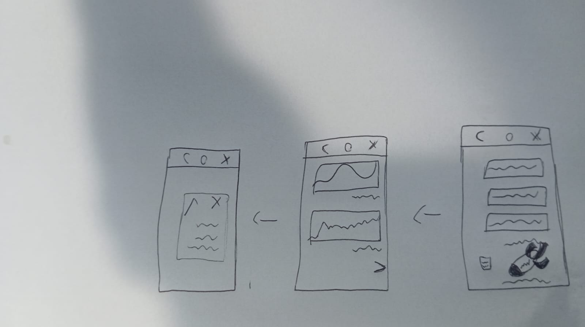
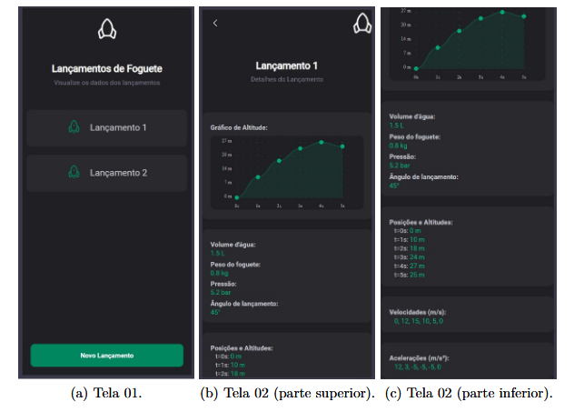

# Prototipo de Software

## Introdução
O protótipo de telas é uma etapa essencial no desenvolvimento de software, pois permite visualizar e validar a interface e a experiência do usuário antes da implementação final. Ele pode ser desenvolvido em três níveis: baixa, média e alta fidelidade, cada um com propósitos distintos dentro do ciclo de projeto.

- O protótipo de baixa fidelidade é simples, geralmente feito em papel ou ferramentas básicas, e foca na estrutura e navegação entre as telas.

- O protótipo de média fidelidade já apresenta mais detalhes visuais e funcionais, simulando de forma mais realista a interação do usuário.

- O protótipo de alta fidelidade se assemelha bastante ao produto final, com design refinado, cores, fontes e funcionalidades interativas.

A utilização desses protótipos é importante porque permite testar ideias, identificar falhas e coletar feedback de usuários e stakeholders com antecedência. Isso reduz custos com retrabalho, melhora a comunicação da equipe e garante um produto final mais alinhado às necessidades do público-alvo. Em resumo, prototipar é uma prática que contribui diretamente para a qualidade e o sucesso de um projeto de software.

## Metodologia

O grupo descidiu que a partir apenas do prototipo de baixa fidelidade já seria possivel implementar um de alta por se tratar de poucas telas e de facil entendimento para implementação

## Prototipo de Baixa Fidelidade

<b>Figura 1:</b> Prototipo de Baixa Fidelidade

<b>Autor:</b> <a href="https://github.com/gabrielfreitass1">Gabriel Freitas</a>
 

## Prototipo de Alta Fidelidade

<b>Figura 2:</b> Prototipo de Alta Fidelidade

<b>Autor:</b> <a href="https://github.com/Guibs969">Guilherme Ferreira</a>
 

## Referência Bibliográfica
> O que é prototipação de software? Disponível em: https://logap.com.br/blog/o-que-e-prototipacao-software/ Acesso em: 14 julho. 2025.

## Histórico de Versão
| Versão | Data       | Descrição                                      | Autor               | Revisor               |
|--------|------------|------------------------------------------------|---------------------|-----------------------|
| 1.0    | 18/07/2025 | Primeira versão do documento de Prototipação| [Gabriel Freitas](https://github.com/gabrielfreitass1) | [Gabriel Freitas](https://github.com/gabrielfreitass1) |
