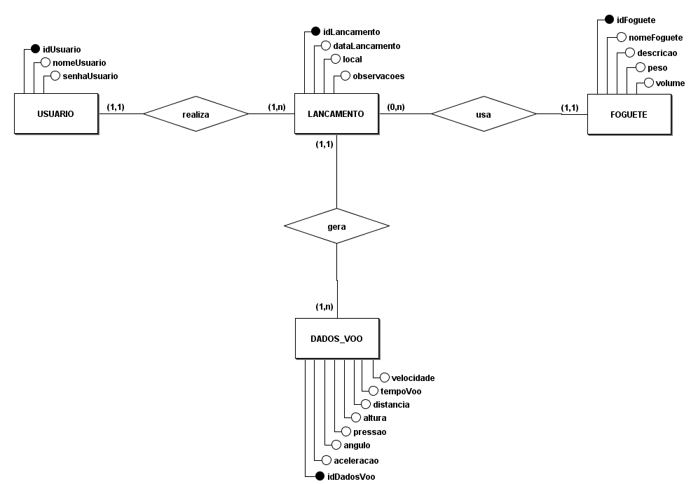

# Diagrama Entidade Relacionamento

## Introdução

O Diagrama Entidade-Relacionamento (também conhecido como Diagrama ER ou DER) é a principal ferramenta gráfica utilizada para representar modelos de dados. Na prática, esse diagrama muitas vezes é tratado como sinônimo do próprio modelo, já que a visualização facilita a compreensão. Sem uma representação gráfica, o modelo pode se tornar abstrato demais, dificultando o desenvolvimento do sistema. Por isso, ao modelar um domínio, é comum que já se construa sua representação visual, seguindo regras específicas.

Além disso, o diagrama ER contribui significativamente para a comunicação entre os membros da equipe. Ele serve como uma linguagem comum entre o analista, que levanta os requisitos, e os desenvolvedores, que implementam o sistema com base no que foi modelado.

Na notação original proposta por Peter Chen, criador do modelo, as entidades são representadas por retângulos, os atributos por elipses e os relacionamentos por losangos, conectados por linhas às entidades. Essa representação inclui ainda a cardinalidade (como 1..1, 1..n ou n..n).
Contudo, notações mais modernas deixaram de usar elipses para atributos e adotaram o estilo mais próximo da UML, onde os atributos são listados diretamente dentro da entidade. Essa abordagem torna o diagrama mais limpo e de leitura mais simples.

## Imagem do DER 

<b>Figura 1:</b> Diagrama Entidade Relacionamento

<b>Autor:</b> <a href="https://github.com/RafaelCLG0">Matheus henrique e Rafael Ferreira</a>
 

## Referência Bibliográfica
> MER e DER: Modelagem de Bancos de Dados Disponível em: https://www.devmedia.com.br/mer-e-der-modelagem-de-bancos-de-dados/14332 Acesso em: 15 julho. 2025.

## Histórico de Versão
| Versão | Data       | Descrição                                      | Autor               | Revisor               |
|--------|------------|------------------------------------------------|---------------------|-----------------------|
| 1.0    | 15/07/2025 | Primeira versão do documento BPMN| [Gabriel Freitas](https://github.com/gabrielfreitass1) | [Gabriel Freitas](https://github.com/gabrielfreitass1) |
